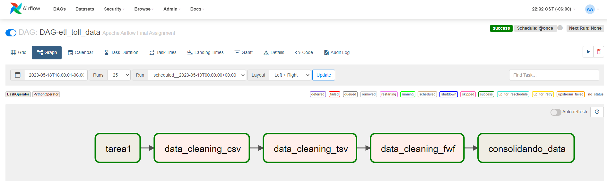

# ETL_Pipeline_using_Airflow
We are going to run Airflow using Docker, 
we can download the docker-compose.yaml using the next command in our folder.
``` batch
curl -LfO 'https://airflow.apache.org/docs/apache-airflow/2.6.0/docker-compose.yaml'
```
you need to add your GID and UID to docker-compose.yaml
``` batch
user: "${AIRFLOW_UID:-1000}:${AIRFLOW_GID:-0}"
```

next, run the next command first
``` batch
docker compose up airflow-init
```
next, you run the next command for the rest of the airflow-services
``` batch
docker compose up 
```
if everything is ok. you will have the next folders created. inside the ./dags folder you create your dags using python 

``` batch
./dags
./logs
./plugins 
```

## Build Docker ETL Pipeline using Airflow

### Scenario

You are a data engineer at a data analytics consulting company. You have been assigned to a project that aims to de-congest the national highways by analyzing the road traffic data from different toll plazas. Each highway is operated by a different toll operator with a different IT setup that uses different file formats. Your job is to collect data available in different formats and consolidate it into a single file.

- Extract data from a csv file
- Extract data from a tsv file
- Extract data from a fixed width file
- Transform the data
- Load the transformed data into the staging area

you can download the raw data using the next command


``` batch
wget https://cf-courses-data.s3.us.cloud-object-storage.appdomain.cloud/IBM-DB0250EN-SkillsNetwork/labs/Final%20Assignment/tolldata.tgz
```
The final csv file should use the fields in the order given below:

``` batch
Rowid, Timestamp, Anonymized Vehicle number, Vehicle type, Number of axles, Tollplaza id, Tollplaza code, Type of Payment code, and Vehicle Code
```

- install the "requirements.txt" file
``` batch
pip install -r requirements.txt
```

Check data and info inside Airflow container bash 
``` batch
docker exec -it [container_name] bash
```

